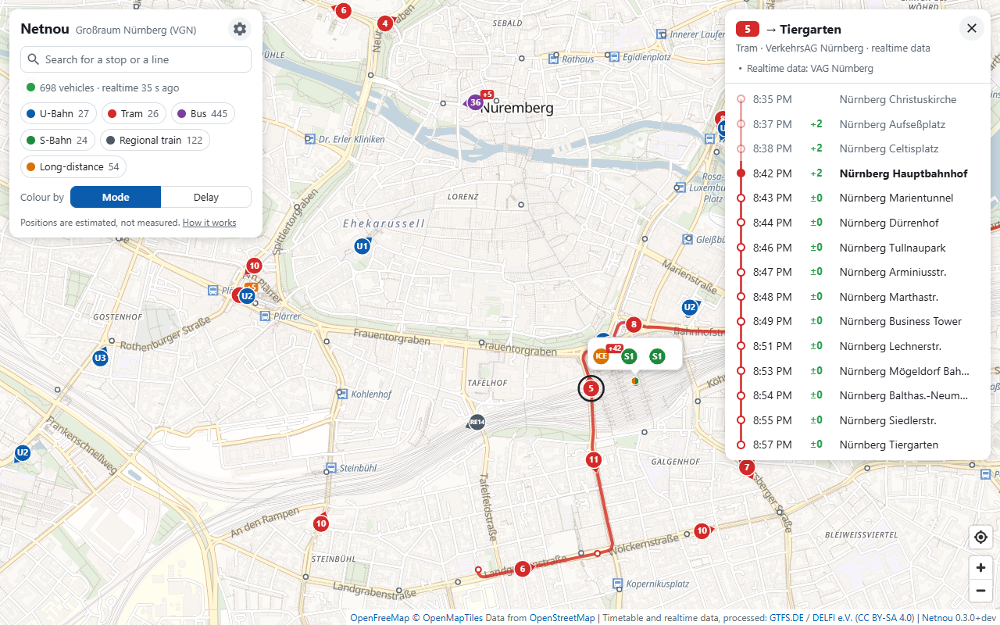

#  Netnou

A live map of public transport, computed from a GTFS timetable, GTFS-Realtime
delays and OpenStreetMap.

[](https://github.com/xiidoz/netnou/actions/workflows/ci.yml)
[](LICENSE)

**Try it:** [öpnv.live](https://xn--pnv-rna.live) is a service for riders that
runs the latest release of Netnou for the default area.



Netnou shows buses, trams, underground, suburban, regional and long-distance
trains moving on a map, with their current delays, the stop list of every trip
and a departure board for every station. Out of the box it covers the VGN, the
transit network around Nürnberg in Germany, using the nationwide feeds of
[gtfs.de](https://gtfs.de); another area is a matter of
[configuration](docs/configuration.md).

**The positions are computed, not measured.** The feeds carry delays but no
vehicle positions, so each vehicle is placed where the timetable plus its
reported delay says it should be.

The name is Afrikaans: *net nou* means "just now", which in South Africa
notoriously means "later, eventually". That suits German public transport,
the *ÖPNV*, rather well.

**Status: early development (0.x).** Settings and the API can still change
from one minor version to the next; the [changelog](CHANGELOG.md) marks such
changes as breaking.

## Features

- Vehicles animated along roads and tracks, coloured by kind of transport or
  by delay.
- A vector map behind them that stays sharp at every zoom level and names
  places in the visitor's language.
- Stop list with delays, skipped stops and cancellations for every trip;
  departure board for every station; notes from the feed.
- Search for stops and lines that runs in the browser. For stops it forgives
  abbreviations, missing umlauts and typing slips; a line shows its vehicles
  under way, alone on the map.
- The visitor's own location on the map, if they ask for it; it stays in
  their browser.
- A button hides the controls for more map, another gives the page the whole
  screen. With `?display=fixed` in its address the page is a
  [display for a screen on a wall](docs/deployment.md#a-screen-on-a-wall).
- User interface in German and English, chosen per visitor; further languages
  are one file each.
- Tells search engines and link previews what it shows and where, in the
  instance's own language.
- Installable as an app (PWA).
- One Node.js process, no database, no npm dependencies at run time, no build
  step.
- The realtime feed is only fetched while somebody is looking at the map.

## Quick start

With Docker:

```sh
docker compose up -d
```

This pulls the published image `ghcr.io/xiidoz/netnou`. `compose.yaml` needs
nothing else from the repository, so it can also be downloaded on its own or
pasted into Portainer as it is.

With Node.js 22 or newer (nothing to install, `npm install` is not needed to
run):

```sh
npm start
```

Then open <http://localhost:8080>.

### What the first start does

The server downloads the timetable of all of Germany (about 300 MB) and cuts it
down to the area, then downloads OpenStreetMap extracts (about 500 MB for the
default area) to work out the paths between stops. On a fast connection that
takes two to five minutes:

- Until the timetable is read, the page shows a notice instead of vehicles.
- After that the map works, with vehicles moving in straight lines between
  stops.
- A minute or two later the route geometry is ready and vehicles follow roads
  and tracks.

The import needs about 1.5 GB of memory for a minute or two. Afterwards the
server keeps two cache files of about 35 MB together in `./data` (the volume
`data` in Docker) and starts from them in a second. The downloads are deleted
when the import is done. (Figures: approximate, default area, October 2026.)

## Configuration

Everything is set with environment variables and everything is optional. The
ones most people touch:

| Variable | Default | Meaning |
| --- | --- | --- |
| `PORT` | `8080` | HTTP port |
| `DATA_DIR` | `./data` | where the caches are kept |
| `BBOX` | – | area to cover as `south,west,north,east`, instead of the VGN |
| `AREA_FILE` | built-in VGN | GeoJSON file with the polygons of the area |
| `AREA_NAME` | `Großraum Nürnberg (VGN)` | shown next to the title |
| `PUBLIC_URL` | – | the address visitors reach the instance under, for search engines and previews of links |
| `OSM_PBF_URLS` | five Bavarian extracts | OpenStreetMap extracts covering the area |
| `MAP_STYLE_URL` | OpenFreeMap, style `bright` | the map behind the vehicles, as a MapLibre style |

For example, München (in a POSIX shell; for PowerShell and Docker see the
configuration guide):

```sh
BBOX=48.06,11.36,48.25,11.72 \
AREA_NAME=München \
OSM_PBF_URLS=https://download.geofabrik.de/europe/germany/bayern/oberbayern-latest.osm.pbf \
npm start
```

All settings, how to describe an area, and what it takes to use other feeds
or another country: [docs/configuration.md](docs/configuration.md).

## Languages

The page is available in German and English. A visitor gets the language of
their browser, English if it is neither, and can switch in the page. Adding a
language means adding one file:
[docs/translating.md](docs/translating.md).

## How it works

- **Import.** A worker thread reads the nationwide GTFS feed straight out of
  the zip and keeps the trips that serve at least one stop in the area. The
  feed is checked for a new version every 15 minutes.
- **Route geometry.** The feed has no route shapes. Every hop "stop A, then
  stop B" is routed over OpenStreetMap: buses on roads, trams, underground and
  trains on their tracks. Where no plausible route is found, the vehicle moves
  in a straight line.
- **Realtime.** The GTFS-Realtime feed is matched to the trips and turned into
  per-stop delays, skipped stops and cancellations.
- **Positions.** The server sends, for every vehicle, where it will be over
  the next minute and a half; the browser animates along that.
- **Outside the area.** A trip is followed along its whole run (a
  long-distance train to Hamburg stays on the map), but it follows roads and
  tracks only inside the area. The map greys out everything outside.

The details are in [docs/architecture.md](docs/architecture.md).

## API

The page uses a small JSON API, which is open to other clients too:

| Endpoint | Answer |
| --- | --- |
| `GET /api/vehicles` | vehicles under way, optionally within `?bbox=` |
| `GET /api/trip?id=…` | one trip: stops, delays, path |
| `GET /api/stations` | stations, optionally within `?bbox=` |
| `GET /api/departures?station=…` | departure board of a station |
| `GET /api/area` | the configured area, map and attribution |
| `GET /api/status` | state of the import and of the realtime feed |

Reference: [docs/api.md](docs/api.md).

## Deployment

[docs/deployment.md](docs/deployment.md) covers Docker, running without it,
reverse proxies, monitoring, what running a public instance involves, and
troubleshooting.

## Development

```sh
npm test         # no installation and no network needed
npm ci           # only for the linter
npm run lint
```

Running needs Node.js 22 or newer; linting needs 22.13 or newer. Commit
messages follow [Conventional Commits](https://www.conventionalcommits.org/);
versions, the [changelog](CHANGELOG.md) and releases are derived from them.
See [CONTRIBUTING.md](CONTRIBUTING.md).

## Data sources, licences and attribution

The code is under the [MIT License](LICENSE). Three things in the repository
are not: the vendored map library MapLibre GL JS
(`public/vendor/maplibre-gl`, BSD-3-Clause), the icons taken from Material
Design Icons (`public/vendor/material-design-icons`, Apache-2.0) and the
outline of the default area (`server/areas/vgn.geojson`, © OpenStreetMap
contributors, ODbL 1.0).

A running instance works with data that it fetches itself and that has its own
terms:

- Timetable and realtime data: [gtfs.de](https://gtfs.de), provided by DELFI
  e.V., CC BY-SA 4.0.
- Roads and tracks for the routes: © OpenStreetMap contributors, ODbL 1.0,
  as extracts from [Geofabrik](https://download.geofabrik.de/).
- The map behind the vehicles: vector tiles of
  [OpenFreeMap](https://openfreemap.org) in the OpenMapTiles scheme, made
  from OpenStreetMap data and loaded by the visitor's browser. OpenFreeMap
  needs no key and sets no limit on requests.

The credits are shown on the map and have to stay visible. Details and what
follows for operators: [THIRD-PARTY-NOTICES.md](THIRD-PARTY-NOTICES.md).

## Disclaimer

Netnou is not affiliated with or endorsed by VGN, VAG, DELFI e.V., gtfs.de or
any transport operator. Positions are estimates computed from the timetable
and the reported delays. Do not rely on them.
