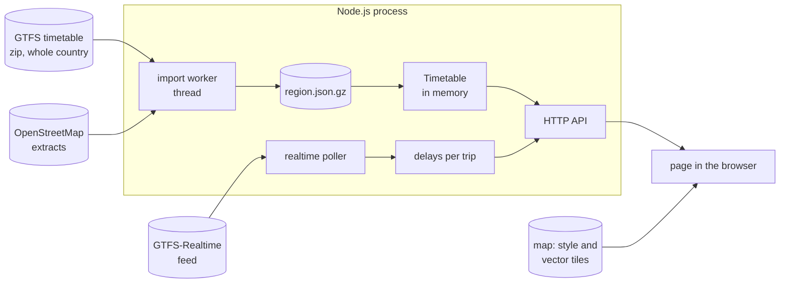

# Architecture

How Netnou turns a timetable, a list of delays and a road map into moving
vehicles. Read this before changing the server; the comments in the code
assume its terms.

- [Overview](#overview)
- [Why positions are computed](#why-positions-are-computed)
- [Modules](#modules)
- [The area](#the-area)
- [Import](#import)
- [Route geometry](#route-geometry)
- [Realtime](#realtime)
- [Failures and retries](#failures-and-retries)
- [Caches and format versions](#caches-and-format-versions)
- [The page](#the-page)
- [Known limits](#known-limits)
- [Glossary](#glossary)

## Overview

One Node.js process does everything. A worker thread cuts the nationwide
timetable down to the area and computes the route geometry; the result is one
compressed file. The main thread loads that file into memory, fetches the
realtime feed while somebody is looking, and answers the API. The page asks
every ten seconds where the vehicles in view will be and animates them in
between.

There is no database and there are no npm dependencies at run time: the zip,
CSV, Protocol Buffers and OpenStreetMap PBF formats are read by small readers
in `server/lib`, each limited to what this project needs.

## Why positions are computed

The realtime feed of gtfs.de carries trip updates (delays) and alerts, but no
vehicle positions. A position is therefore derived:

1. For every stop of a trip, the expected arrival and departure are the
   timetable times plus the reported delay. A delay carries forward to later
   stops until the feed says otherwise. The times are forced to be
   non-decreasing.
2. Between two stops the vehicle moves at constant speed along the route
   geometry of that hop, or along a straight line where there is none.
3. Without realtime data for a trip, the timetable alone is used. The page
   marks such a vehicle with a question mark while others have a delay
   reported. Without any realtime data it says so once, as a warning in the
   header card.
4. Trains that run coupled are a trip each, in the timetable and in the
   feed, and the feed may report a delay for one portion and not for the
   others. One train cannot be at two places: on the way the portions share
   from one stop to the next, all of them get the same delay at either end.
   What the feed reports for that stop itself counts before what is carried
   forward from an earlier stop. Of those that count it is the delay most
   portions have, and the largest where as many have one as the other. A
   portion the feed has no word on gets what the others say for that way.
   The delays of a trip, at its stops and on a departure board, are these
   too, so that they agree with the map.

The server does not send positions but *knots*: points in time and space along
the way ahead (see [Knots](api.md#knots)). The browser interpolates, so the
animation is smooth without a request per frame.

## Modules

Server (`server/`):

| File | Responsibility |
| --- | --- |
| `index.js` | HTTP server: static files, the API, security headers, start and shutdown |
| `config.js` | reads and checks the settings (`loadConfig`) |
| `lib/area.js` | the area as a grid of cells with their distance to it (`Area`, `NEAR`) |
| `lib/feed.js` | keeps the timetable current: version check, download, worker, retries (`FeedUpdater`) |
| `lib/import-worker.js` | worker thread: import, route geometry, writing the dataset |
| `lib/importer.js` | cuts the GTFS feed down to the area (`buildDataset`); documents the dataset layout |
| `lib/zip.js`, `lib/csv.js` | read entries straight out of the zip (including zip64) and split CSV lines |
| `lib/osmpbf.js` | reads the ways of an `.osm.pbf` extract |
| `lib/network.js` | builds routable networks from the ways and finds paths (`classifyWay`, `Network`) |
| `lib/shapes.js` | route geometry for every hop (`loadNetworks`, `buildSegments`) |
| `lib/timetable.js` | the loaded dataset and the queries of the API (`Timetable`) |
| `lib/realtime.js` | fetches the realtime feed, matches it to the trips (`RealtimePoller`) and gives the portions of a coupled train the same delays where they share their way |
| `lib/http.js` | the GET the realtime feed is fetched with: patient with a busy server (`get`) |
| `lib/pb.js` | decodes the GTFS-Realtime message (`decodeFeed`) |
| `lib/update.js` | what the server calls itself (`describeBuild`) and the daily look-out for a newer release (`UpdateChecker`) |
| `lib/time.js` | service days and the time zone of the feed |
| `lib/page.js` | what the server writes into the page before it sends it, for search engines and previews of links, and what the page is to fetch right away; `robots.txt` and the sitemap; which files of the operator's own take the place of built-in icons |
| `lib/files.js` | downloads, gzipped JSON files, error texts |
| `areas/vgn.geojson` | outline of the default area, see [its README](../server/areas/README.md) |

Page (`public/`):

| File | Responsibility |
| --- | --- |
| `index.html`, `style.css` | structure and appearance; colours for canvas and DOM live in the style sheet |
| `app.js` | map, polling, animation, drawing on a canvas, detail panel |
| `display.js` | display mode in the address of the page: what an address asks for, and the address for what is shown |
| `search.js` | finding stops and lines by name: matching and order, without the page around it |
| `i18n.js`, `locales/` | texts in the visitor's language, see [translating.md](translating.md) |
| `theme.js` | light or dark: puts the visitor's choice, or else the scheme of the device, on the page before it is drawn |
| `sw.js`, `manifest.webmanifest`, `icons/` | installable app and offline start |
| `vendor/maplibre-gl/` | the map library, vendored, see [its README](../public/vendor/maplibre-gl/README.md) |
| `vendor/material-design-icons/` | the shapes of the icons on the page's own buttons, see [its README](../public/vendor/material-design-icons/README.md) |

`tools/` holds three scripts that are run by hand: `build-vgn-area.mjs`
regenerates the default area, `build-icons.mjs` renders the app icons from
`favicon.svg`, and `build-social-preview.mjs` renders the image for link
previews from the README screenshot.

## The area

The area is a set of polygons (`AREA_FILE`, or the built-in VGN) or a
rectangle (`BBOX`). `Area` rasters it into cells of about 1.1 km and stores
for each cell its distance to the area in cells, up to 8. "Is this point
inside, or within a few kilometres?" is then a table lookup, which matters
because it is asked for every stop of a national timetable and for tens of
millions of OpenStreetMap nodes.

Three distances, in cells, decide what counts (`NEAR` in `lib/area.js`):

| Name | Cells | Meaning |
| --- | --- | --- |
| `region` | 1 | a stop this close belongs to the area |
| `exit` | 4 | routes to stops far outside follow the network this far, then go straight |
| `osm` | 7 | OpenStreetMap data is kept up to here |

An area has an id, a hash of its polygons and the grid constants. Cached data
is tied to it, so changing the area invalidates the caches.

## Import

`lib/import-worker.js` runs in a worker thread, because reading 40 million
rows keeps a core busy for a while. For the default area it reduces the feed
of all of Germany to about 98,000 trips and 13,500 stations.

1. **Stops in the area.** `stops.txt` is read once to find the stops within
   `NEAR.region` of the area.
2. **Trips.** `stop_times.txt` is streamed. Only the trip and stop ids of
   each row are looked at; a trip is kept if one of its stops is in the area,
   and only kept trips are parsed in full. This relies on the rows of a trip
   being next to each other. Missing times are filled in from their
   neighbours.
3. **The rest.** `trips.txt`, `routes.txt`, `agency.txt`, `calendar.txt` and
   `calendar_dates.txt` are read for the kept trips, then `stops.txt` again
   for every stop they call at, also outside the area, and their parent
   stations.
4. **Interim dataset.** If the server has nothing to show yet, the dataset is
   saved without route geometry and loaded, so that the map works with
   straight lines while the next step runs.
5. **Route geometry**, see below.
6. **Dataset.** The result is written to `region.json.gz` and the main thread
   loads it. Its layout, a set of parallel arrays, is described above
   `buildDataset` in `lib/importer.js`.

## Route geometry

The feed has no `shapes.txt`, so the path of every *hop* (two consecutive
stops of a trip, on one network) is found by routing over OpenStreetMap. For
the default area that is about 60,000 distinct hops.

- **Networks.** `classifyWay` sorts OpenStreetMap ways into four networks:
  `road` for buses, and `tram`, `subway` and `rail` for vehicles on tracks.
  Roads carry a cost factor so that buses prefer main roads, and respect
  one-way streets, access restrictions and the exemptions for buses. The
  networks are cached in `osm-networks.json.gz` and built again when the
  OpenStreetMap data is older than `OSM_MAX_AGE_DAYS`, when the area or the
  list of extracts changes.
- **Snapping.** A stop is rarely exactly on its road or track. Candidates on
  nearby edges are considered, up to 70 m away for buses and up to 400 m for
  trains (whose stop is often the centre of the station), with a penalty per
  metre of offset.
- **Search.** An A* search finds the cheapest path from a candidate of stop A
  to a candidate of stop B.
- **Plausibility.** A path much longer than the straight line (more than 2 to
  2.5 times plus a few hundred metres, depending on the network) is thrown
  away. This is a shortest-path guess, not the operator's official route;
  between stops a few hundred metres apart it is almost always the same.
- **Beyond the area.** Where one stop of a hop is outside the area, the path
  follows the network to about 4 km beyond the edge and continues in a
  straight line. The OpenStreetMap data may end before that, as the extracts
  of a federal state do at its border: the straight line then begins where
  the network stops leading towards the stop. The limit on the length applies
  here as well. Hops entirely outside mostly have no geometry.
- **Fallback.** A hop without a path is a straight line. In October 2026 that
  was the case for about 1 % of the hops inside the default area.
- **Storage.** Paths are simplified to 1.5 m accuracy and stored once per
  hop, shared by all trips that use it.

If no OpenStreetMap data can be loaded at all, the map works with straight
lines.

## Realtime

`RealtimePoller` fetches the GTFS-Realtime feed every
`REALTIME_INTERVAL_SECONDS`, but only while the API is in use (see
[Realtime polling and traffic](configuration.md#realtime-polling-and-traffic)).
Each fetch produces a new snapshot:

- **Matching.** A trip update is matched by `trip_id` and `start_date`. It is
  ignored if the trip does not run that day, or if a stop id in it differs
  from the timetable's; that protects against a mismatch on the day a new
  timetable is published. A predicted time more than six hours off the
  schedule is ignored as well.
- **Delays** per stop follow the GTFS-Realtime rule that a delay applies to
  later stops until the next update. Skipped stops and cancelled trips are
  recorded.
- **Alerts** addressed to a trip or a stop become notes, shown while one of
  their active periods is current. gtfs.de also uses an alert to name the
  operator who provides a trip's realtime data; that is recognised and offered
  as the trip's `source` instead of a note.
- **Staleness.** When fetching fails, the last delays are used until they are
  three minutes old; after that the server falls back to the timetable. When
  nobody is looking, the snapshot is dropped.

The feed is fetched with `get` of `lib/http.js`, not with `fetch()`. The
provider's server is slow to accept connections and slow to deliver at busy
times, and `fetch()` gives up on a connection after ten seconds, which cannot
be changed without a dependency. `get` has one limit for the whole request,
90 seconds for the realtime feed:

- While the server has not accepted the connection, it is asked again: after
  ten seconds without an answer, or after a pause that grows from one to
  eight seconds if the attempt failed at once.
- Once the connection is accepted, nothing is started over. The request waits
  for the answer and for the whole of it, however slowly it comes.
- A fetch may therefore outlast the polling interval. The turns of the
  interval that come meanwhile are left out.

## Failures and retries

- **Feed version check** (`HEAD`, every `FEED_CHECK_MINUTES`): a failure is
  logged and the check simply runs again next time. The loaded timetable
  stays in use.
- **Download refused** (HTTP error, no connection): tried again at the next
  check, since nothing was transferred.
- **Download broken off or import failed:** that version of the feed is left
  alone for an hour, then two hours, doubling up to a day. A new version is
  tried at once. This keeps a server whose import cannot succeed from
  downloading 300 MB every 15 minutes.
- **No route geometry:** the OpenStreetMap step is tried again after an hour,
  with the same doubling.
- **Start:** a setting that is not acceptable, a port that cannot be opened
  or a data directory that cannot be written ends the process with exit
  code 1.
- **Damaged cache files** are discarded and rebuilt. Cache files are written
  under a temporary name and renamed, so a crash cannot leave half a file.

The waits are kept in memory; a restart tries everything again at once.

## Caches and format versions

The data directory (`DATA_DIR`) holds:

| File | Content | Lifetime |
| --- | --- | --- |
| `region.json.gz` | the dataset: timetable of the area with route geometry | until a new feed version is imported |
| `osm-networks.json.gz` | the routable networks | `OSM_MAX_AGE_DAYS` |
| `feed.zip`, `osm-<n>.pbf` | downloads | only during an import |

Everything can be deleted at any time and is rebuilt.

Two constants guard the formats. Bump them when you change what is stored;
otherwise a server would load a file written by older code:

- `DATASET_VERSION` in `lib/importer.js`: the layout or meaning of anything
  in the dataset, including the route geometry.
- `NETWORKS_VERSION` in `lib/shapes.js`: `classifyWay`, the cost factors or
  the output of `NetworkBuilder`.

## The page

- **Map.** MapLibre GL JS draws the map with WebGL, from the vector tiles of
  the configured style or from raster tiles. Everything else is drawn by
  `app.js` on one canvas lying on top: the veil outside the area, stations,
  the route of the selected trip, the visitor's own position, vehicles. The
  map is never rotated or tilted.
- **Polling.** Every 10 seconds the page asks for the vehicles in the visible
  section plus a margin, in full detail from zoom level 12 and in the reduced
  form below. (Zoom levels are those of MapLibre, one less than the number in
  the address of a raster tile.) Moving the map beyond what is loaded asks again at once. A tab
  in the background stops asking, which lets the server pause the realtime
  feed.
- **Animation.** Vehicles are placed along their knots against the server's
  clock, and eased towards a new position when a changed delay moves them.
- **Several at one place.** Markers that would hide each other are drawn as
  one. Trains that run coupled are a trip each in the feed, which has no
  word on that they belong together; the server finds them by the way from
  stop to stop that they share at the same times of the timetable, and
  gives them the same `unit`. The page draws such a unit as one marker with
  the name of each train, one arrow and one delay, and each name opens its
  own trip. Whatever else is at one place, buses at a stop or trains at the
  same platform, is in a bubble above a dot that marks the place. "At one
  place" means at most 4 px apart on the screen, and standing there or
  heading the same way: vehicles that only pass each other are not, and
  those that stand near each other part when the map is zoomed in.
- **Detail panel.** A click on a vehicle shows its trip, a click on a station
  its departures, a line chosen in the search its vehicles under way; all
  refresh every 15 seconds. While a line is shown, the map draws its
  vehicles alone, with their names at any zoom and whatever the filters say.
  A trip opened from the list of a line leads back to it. What the details
  are of, their head, stays at the top while what is listed scrolls below it.
- **The details as a sheet.** On a narrow screen the details are a sheet
  from the bottom. The bar at its top and its head move it between three
  heights: its head alone, about half the screen, and up to the header
  card. Dragged and let go of slowly it comes to rest at the nearest of
  them; flicked, at the next one in that direction. Below the lowest it
  closes. A tap on the bar takes it one height up, and from the highest
  back to the middle. The height holds while the details stay open, and
  what is chosen on the map is moved into the part the sheet leaves free.
  There is no button to close in sight: the one there is, is for the
  keyboard and for screen readers and shows itself with the focus. "How it
  works" is such a sheet too and closes when it is dragged down. All of
  this is plain pointer events in `app.js`.
- **Search.** The field in the header card finds stops and lines by name.
  The list of all of them is fetched when the field is first used, and
  searched in the browser: what is typed stays there, and so does the
  visitor's position, which the order of the results makes use of. A stop matches if every word
  typed begins one of the words of its name, in any order; matches inside a
  word come after those, and close spellings are tried where nothing else is
  found. Among equally close matches the stop with more service comes
  first, and with the visitor's position known, service counts for less the
  further away a stop is. `search.js` holds all of that and knows nothing of
  the page, so the tests run it as it is. Choosing a stop moves the map
  there and opens its departure board. A line is found by the beginning of
  its name, with its mode in front if somebody types one ("bus 33"), and is
  told from others of the same name by where it goes and who runs it.
- **Own position.** A button above the zoom buttons shows where the visitor
  is and has the map follow them, until they move the map themselves or
  switch it off. It is off at every start, and a visitor outside the area is
  told so while the map stays where it is. The marker lies under the
  vehicles, with a ring wider than their markers, so that both show when the
  visitor is in one. The button and the following are the page's own, only
  the icons are those of MapLibre's `GeolocateControl`: that control moves
  the map before it says where the visitor is. The position stays in the
  browser ([what the server gets to see](deployment.md#running-a-public-instance)).
- **Offline start.** The service worker fetches from the network first and
  falls back to its cache, so an update shows up immediately and the
  installed app can still start without a connection (and then says that it
  needs one). API answers and the map are never cached.
- **Texts** come from locale files through `t()`; nothing a visitor reads is
  written out in `app.js` or sent by the server, apart from data such as
  names of stops and notes of the feed. See [translating.md](translating.md).
- **Before any script runs** the page already says what and where the
  instance is: the server writes the title, the description, the name of the
  instance and the name of the area into `index.html` when it sends it, in the main language of the
  instance or the one the address asks for (`?lang=de`), with the tags for
  previews of links and, if it knows its public address, the canonical
  address and the versions in other languages. That is what search engines
  and chats read. The script puts the same texts in for the visitor, in
  their language; both take them from `pageTexts` in `i18n.js`. The
  manifest of the installed app gets the name, the language and the
  description of the instance the same way.
- **What the page fetches at its start** it would learn of step by step: of
  `app.js` from the page, of the map library from `app.js`, of the area and
  the style of the map only once the script runs. The server names all of it
  in the head of the page (`PAGE_MODULES` and `renderPage` in `lib/page.js`):
  the scripts with the texts of the page's language, `api/area` and
  `api/status`, and the style of the map, or with raster tiles the
  connection to their server. The browser then asks for everything at once.
- **Security.** The Content-Security-Policy allows scripts, styles, workers
  and connections from the page's own origin only. The one exception is the
  map, which may be fetched from the server of its style or tiles and from
  those in `MAP_ORIGINS`. There are no inline scripts or styles.
- **Browsers.** There is no build step, so the page runs as written. The map
  library sets the floor: it needs WebGL 2 and the JavaScript of 2022,
  roughly Chrome and Edge 94, Firefox 114, Safari 16.4 and newer.
- **Accessibility.** Filters, the settings, the search, the dialogs, the detail
  panel and its lists are ordinary controls and work with the keyboard; the
  search is the way to a station without a pointer. On the canvas, vehicles
  and stations can be selected with a pointer only.
  On a narrow screen the filters are one row that scrolls sideways; arrows at
  its ends show that it goes on and move it. They are left out of the tab
  order and hidden from screen readers, which reach every filter directly.

## Known limits

- Positions are estimates. Between two stops the speed is assumed constant,
  and a route is a shortest-path guess.
- The feed's own `shapes.txt` is ignored.
- Kinds of train are recognised by line names as used in Germany.
- One time zone for the whole feed (`TIMEZONE`); `agency_timezone` is not
  read.
- A timetable server without `ETag` and `Last-Modified` is never refreshed.
- Alerts for whole agencies, routes or route types are not shown. Of an alert
  in several languages the German text is used.
- The departure board is fixed at two hours and 40 entries.
- The grid of the area assumes a latitude of about 49–50° north.
- The installed app's name and description (web app manifest) are in English
  only. Right-to-left languages are not prepared.
- The API has no rate limiting.

What these mean for other feeds and countries, and where to change them:
[configuration.md](configuration.md#other-feeds-and-other-countries).

## Glossary

| Term | Meaning |
| --- | --- |
| area | the region covered, from `BBOX` or `AREA_FILE` |
| stop | a row of `stops.txt`, often a single platform |
| station | the stop that groups platforms (`parent_station`); what the map shows and a departure board is for |
| hop | two consecutive stops of a trip |
| network, net | one of the four routable graphs: `road`, `rail`, `subway`, `tram` |
| segment | the routed path of a hop on one network |
| knots | `[time, lat, lon, …]` along a vehicle's way ahead |
| mode | kind of transport as the page shows it, see [Modes](api.md#modes) |
| service day | the day a trip belongs to in the timetable; its times can exceed 24:00 |
| dataset | the timetable of the area with its route geometry, as stored in `region.json.gz` |
